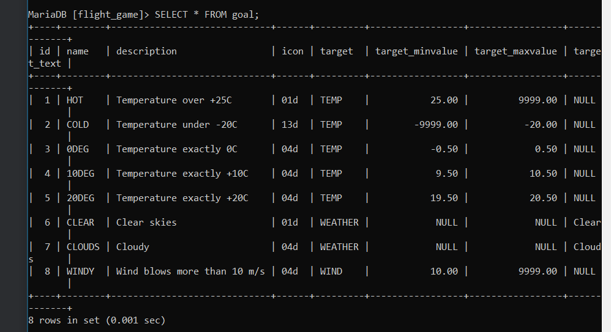
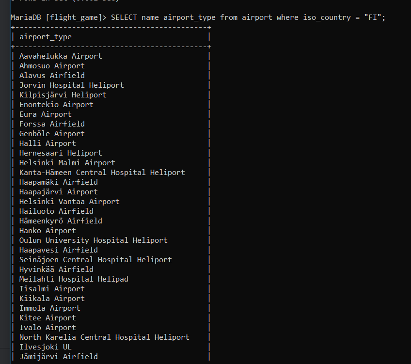
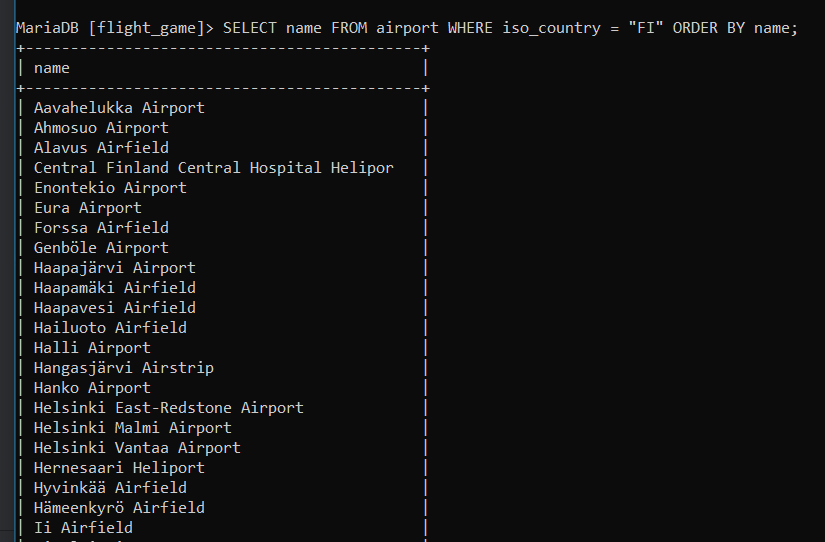
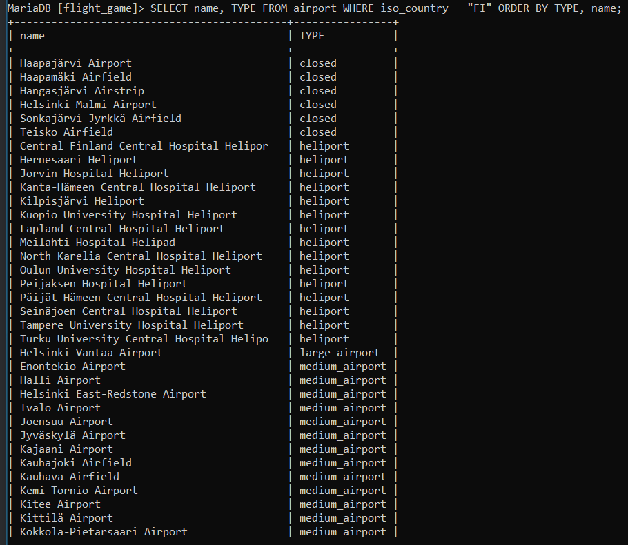
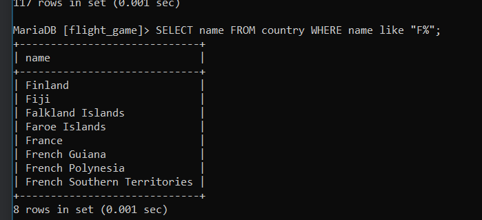
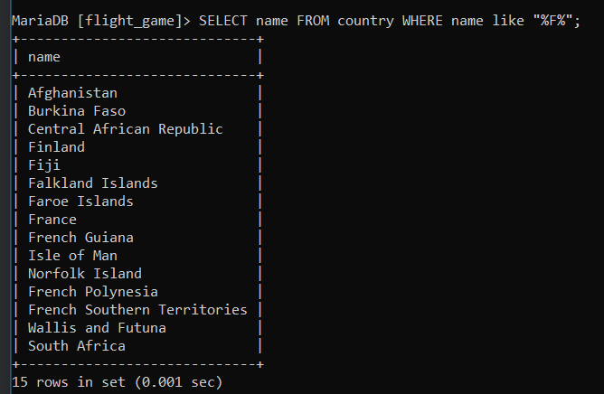
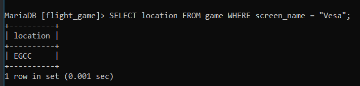
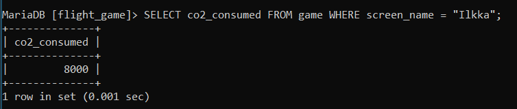
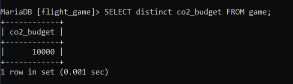

### Tehtävä 1, 1
SHOW TABLES;
### Näyttää "5 rows"

### Tehtävä 1, 2
SHOW columns FROM country;
### Näyttää "5 rows"

### Tehtävä 1, 3
SHOW columns FROM airport;
### Nähdään että ident key paikassa on "PRI"

### Yhteen tauluun kohdistuvien kyselyiden harjoitukset
### Tajusin vasta siis täällä miten nämä screenshotit toimivat
### Tehtävä 1
SELECT * FROM goal;

### Tehtävä 2
SELECT name airport_type from airport where iso_country = "FI";

### Tehtävä 3
SELECT name FROM airport WHERE iso_country = "FI" ORDER BY name;

### Tehtävä 4
SELECT name, TYPE FROM airport WHERE iso_country = "FI" ORDER BY TYPE, name;

### Tehtävä 5
SELECT name FROM country WHERE name like "F%";

### Tehtävä 6
SELECT name FROM country WHERE name like "%F%";

### Tehtävä 7
SELECT location FROM game WHERE screen_name = "Vesa";

### Tehtävä 8
SELECT co2_consumed FROM game WHERE screen_name = "Ilkka";

### Tehtävä 9
SELECT distinct co2_budget FROM game;

