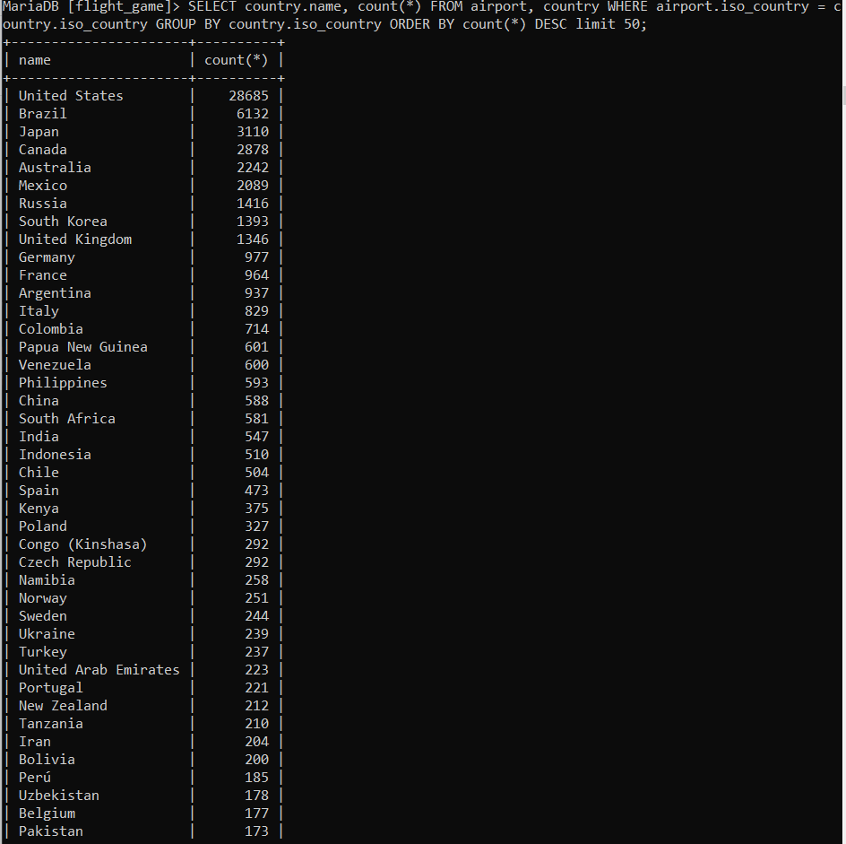

### Tehtävä 1, 1
SHOW TABLES;
### Näyttää "5 rows"

### Tehtävä 1, 2
SHOW columns FROM country;
### Näyttää "5 rows"

### Tehtävä 1, 3
SHOW columns FROM airport;
### Nähdään että ident key paikassa on "PRI"

### Yhteen tauluun kohdistuvien kyselyiden harjoitukset
### Tajusin vasta siis täällä miten nämä screenshotit toimivat
### Tehtävä 1
SELECT * FROM goal;

### Tehtävä 2
SELECT name airport_type from airport where iso_country = "FI";

### Tehtävä 3
SELECT name FROM airport WHERE iso_country = "FI" ORDER BY name;

### Tehtävä 4
SELECT name, TYPE FROM airport WHERE iso_country = "FI" ORDER BY TYPE, name;

### Tehtävä 5
SELECT name FROM country WHERE name like "F%";

### Tehtävä 6
SELECT name FROM country WHERE name like "%F%";

### Tehtävä 7
SELECT location FROM game WHERE screen_name = "Vesa";

### Tehtävä 8
SELECT co2_consumed FROM game WHERE screen_name = "Ilkka";

### Tehtävä 9
SELECT distinct co2_budget FROM game;

### Where-osan liitosehto harjoitukset

### Tehtävä 1
SELECT country.name AS "country name", airport.name AS "airport name" FROM airport, country WHERE airport.iso_country = country.iso_country and country.name = "Iceland";

### Tehtävä 2
SELECT airport.name as "airport name" FROM airport, country WHERE airport.iso_country = country.iso_country AND country.name = "France" AND airport.type = "large_airport";

### Tehtävä 3
select country.name as country_name, airport.name as airport_name from airport, country where airport.iso_country = country.iso_country and country.continent = "AN";

### Tehtävä 4
SELECT elevation_FT from airport, game where location = ident and screen_name = "Heini";

### Tehtävä 5
SELECT elevation_FT * 0.3048 as elevation_m from airport, game where location = ident and screen_name = "Heini";

### Tehtävä 6
SELECT name from airport, game where location = ident and screen_name = "Ilkka";

### Tehtävä 7
select country.name from airport, game, country where location = ident and airport.iso_country = country.iso_country  and screen_name = "Ilkka";

### Join osio

### Tehtävä 1
SELECT country.name AS "country name", airport.name AS "airport.name" FROM country inner JOIN airport ON airport.iso_country = country.iso_country WHERE country.name = "Finland" and scheduled_service = "yes";

### Tehtävä 2
SELECT screen_name, airport.name FROM game inner JOIN airport on location = ident;

### Tehtävä 3
SELECT screen_name, country.name FROM game inner JOIN airport on location = ident inner JOIN country ON airport.iso_country = country.iso_country;

### Tehtävä 4
SELECT airport.name, screen_name FROM airport left JOIN game on ident = location where name like "%Hels%";

### Tehtävä 5
SELECT name, screen_name FROM goal LEFT JOIN goal_reached ON goal.id = goal_id LEFT JOIN game ON game.id = game_id;

### Sisäkysely harjoitukset

### Tehtävä 1
SELECT name FROM country WHERE iso_country in(SELECT iso_country FROM airport WHERE name LIKE "Satsuma%");

### Tehtävä 2
SELECT name FROM airport WHERE iso_country in(SELECT iso_country FROM country WHERE name= "Monaco");

### Tehtävä 3
SELECT screen_name FROM game WHERE id IN (select game_id from goal_reached where goal_id in(SELECT id FROM goal WHERE name = "CLOUDS"));

### Tehtävä 4
SELECT country.name FROM country WHERE iso_country NOT IN (SELECT airport.iso_country FROM airport);

### Tehtävä 5
SELECT name FROM goal WHERE id NOT IN(SELECT goal.id FROM goal, goal_reached, game WHERE game.id = game_id and goal.id = goal_id AND screen_name = "Heini");

### Koostetieto kyselyt harjoitukset

### Tehtävä 1
SELECT max(elevation_ft) FROM airport;

### Tehtävä 2
SELECT continent, count(*) FROM country GROUP BY continent;

### Tehtävä 3
SELECT screen_name, count(*) FROM game, goal_reached WHERE id = game_id GROUP BY screen_name;

### Tehtävä 4
SELECT screen_name FROM game WHERE co2_consumed in(SELECT min(co2_consumed)FROM GAME);

### Tehtävä 5
SELECT country.name, count(*) FROM airport, country WHERE airport.iso_country = country.iso_country GROUP BY country.iso_country ORDER BY count(*) DESC limit 50;

### Tehtävä 6
SELECT country.name FROM airport, country WHERE airport.iso_country = country.iso_country GROUP BY country.iso_country HAVING count(*) > 1000;

### Tehtävä 7
SELECT name FROM airport WHERE elevation_ft IN (SELECT max(elevation_ft) FROM airport);

### Tehtävä 8
SELECT name FROM country WHERE iso_country in (SELECT iso_country FROM airport WHERE elevation_ft IN(SELECT max(elevation_ft)FROM airport));

### Tehtävä 9
SELECT count(*) FROM game, goal_reached WHERE id = game_id and SCREEN_name = "Vesa" GROUP BY screen_name;

### Tehtävä 10
SELECT name FROM airport WHERE latitude_deg in(SELECT min(latitude_deg) FROM airport);

### Päivityskyselyt harjoitukset

### Teht 1
UPDATE game SET location = (SELECT ident FROM airport WHERE name = "Nottingham Airport"), co2_consumed = co2_consumed+500 WHERE screen_name = "Vesa";
SELECT * FROM game;

### Teht 2
### a. goal_reached

### Teht 3
DELETE FROM goal_reached;
### Kuva puuttuu koska en halua rikkoa sql:ää vahinkossa

### Teht 4
DELETE from game;
### Sama juttu mikä edellisessä